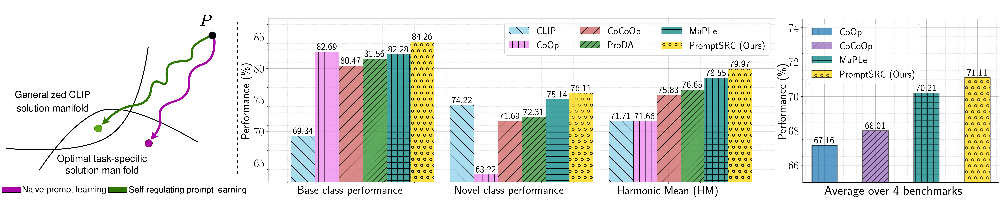

# FusePrompt: A Prompt Fusion Framework for Vision-Language Adaptation

[](#citation)
[](#citation)
[](#installation)

> **FusePrompt: A Prompt Fusion Framework for Vision-Language Adaptation** <br>
> Muhammad Bilal, *(add co-authors / supervisor here)* <br>
> *(Add affiliation here)* <br>
> Submitted to *Image and Vision Computing* <br>
> [[Paper](#)] [[Supplementary](#)] *(add links when available)*

<hr />

## Table of Contents

- [Abstract](#abstract)
- [Highlights](#highlights)
- [Framework](#framework)
- [Results](#results)
- [Repository Structure](#repository-structure)
- [Installation](#installation)
- [Data Preparation](#data-preparation)
- [Training](#training)
- [Evaluation and Reproducing Results](#evaluation-and-reproducing-results)
- [Model Zoo](#model-zoo)
- [Citation](#citation)
- [Contact](#contact)
- [Acknowledgements](#acknowledgements)

## Abstract

> *Paste the abstract of your paper here.*

## Highlights

- **Dual-branch prompt fusion.** FusePrompt combines two complementary prompt learning branches on top of a frozen CLIP backbone: an independent V-L prompting branch (PromptSRC-style, **IPL**) and a multi-modal prompting branch (MaPLe-style, **MMPL**).
- **Fused predictions.** The logits of the two branches are combined to get the final prediction (see `logits_selection` in `trainers/fuseprompt.py`).
- **Works across settings.** Evaluated on base-to-novel generalization and cross-dataset transfer over 11 image recognition datasets.
- **Efficiency analysis.** The paper reports computational overhead (FLOPs, latency, throughput, peak GPU memory) of each branch and of the fused model.

## Framework

<!-- Put your main figure in docs/ and update the file name below -->
<p align="center">
  
</p>

> *Write 2-3 lines here describing the figure: what the two branches are, where prompts are inserted (vision/text encoder, depth), and how the branches are fused.*

Default settings (see `configs/trainers/FusePrompt/`):

| Setting | Value |
|---|---|
| Backbone | CLIP ViT-B/16 |
| Vision / text context tokens | 4 / 4 |
| Prompt depth (vision / text) | 9 / 9 |
| Context init | "a photo of a" |
| Optimizer | SGD, lr 0.0025, cosine schedule |
| Shots | 16 |

## Results

> *Fill these tables from your paper. Keep numbers identical to the paper.*

### Base-to-Novel Generalization

| Method | Base | Novel | HM |
|---|:---:|:---:|:---:|
| CLIP | 69.34 | 74.22 | 71.70 |
| CoOp | 82.69 | 63.22 | 71.66 |
| CoCoOp | 80.47 | 71.69 | 75.83 |
| MaPLe | 82.28 | 75.14 | 78.55 |
| PromptSRC | 84.26 | 76.10 | 79.97 |
| **FusePrompt (ours)** | **xx.xx** | **xx.xx** | **xx.xx** |

(Averages over 11 datasets. CLIP to PromptSRC numbers are from the PromptSRC paper.)

### Cross-Dataset Transfer

| Method | Source (ImageNet) | Avg. over target datasets |
|---|:---:|:---:|
| **FusePrompt (ours)** | xx.xx | xx.xx |

Per-dataset and seed-wise results (3 seeds) are in the supplementary material.

## Repository Structure

```
FusePrompt/
├── clip/                  # CLIP model code
├── configs/
│   ├── datasets/          # Dataset configs
│   └── trainers/          # Trainer configs (FusePrompt, PromptSRC, MaPLe, IVLP, CoOp, CoCoOp)
├── Dassl.pytorch/         # Dassl training library (bundled)
├── datasets/              # Dataset loaders
├── docs/                  # Install / dataset / train / eval instructions
├── interpret_prompts/     # Scripts to interpret learned prompts
├── lpclip/                # Linear-probe CLIP features
├── scripts/
│   ├── fuseprompt/        # Run scripts for FusePrompt
│   └── ...                # Scripts for baselines
├── trainers/
│   ├── fuseprompt.py      # FusePrompt trainer (this work)
│   ├── promptsrc.py, maple.py, independentVL.py, coop.py, cocoop.py, zsclip.py
├── clip_words.csv
├── parse_test_res.py      # Averages results over seeds
├── train.py               # Main entry point
└── requirements.txt
```

## Installation

Tested on Ubuntu with Python 3.8. Full details are in [docs/INSTALL.md](docs/INSTALL.md).

```bash
# 1. Clone
git clone https://github.com/muhammad-bilal-01/FusePrompt.git
cd FusePrompt

# 2. Create environment
conda create -y -n fuseprompt python=3.8
conda activate fuseprompt

# 3. Install PyTorch (match your CUDA version, see https://pytorch.org)
pip install torch==1.9.0+cu111 torchvision==0.10.0+cu111 torchaudio==0.9.0 -f https://download.pytorch.org/whl/torch_stable.html

# 4. Install Dassl (bundled in this repo)
cd Dassl.pytorch
pip install -r requirements.txt
python setup.py develop
cd ..

# 5. Install remaining requirements
pip install -r requirements.txt
```

CLIP weights are downloaded automatically on the first run.

## Data Preparation

Follow [docs/DATASETS.md](docs/DATASETS.md) to download and organize all datasets under one folder (`$DATA`).

Datasets used: ImageNet, Caltech101, Oxford Pets, Stanford Cars, Flowers102, Food101, FGVC Aircraft, SUN397, DTD, EuroSAT, UCF101 (and ImageNetV2, ImageNet-Sketch, ImageNet-A, ImageNet-R for domain generalization).

Then open the script you want to run (inside `scripts/fuseprompt/`) and set the dataset path:

```bash
DATA="/path/to/dataset/folder"
```

## Training

Run all commands from the repository root. Every script takes `DATASET` and `SEED` as arguments.

### Base-to-Novel Generalization

Config: `configs/trainers/FusePrompt/vit_b16_c2_ep20_batch4_4+4ctx.yaml`

```bash
# Train on base classes (example: caltech101, seeds 1-3)
bash scripts/fuseprompt/base2new_train.sh caltech101 1
bash scripts/fuseprompt/base2new_train.sh caltech101 2
bash scripts/fuseprompt/base2new_train.sh caltech101 3
```

Other `DATASET` values: `imagenet`, `food101`, `dtd`, `ucf101`, `oxford_flowers`, `oxford_pets`, `fgvc_aircraft`, `stanford_cars`, `sun397`, `eurosat`.

Outputs are saved to `output/base2new/train_base/<dataset>/shots_16/FusePrompt/<cfg>/seed<seed>`.

### Cross-Dataset Transfer

Config: `configs/trainers/FusePrompt/vit_b16_c2_ep20_batch4_4+4ctx_cross_datasets.yaml`

Train on ImageNet (all 1000 classes, 16 shots):

```bash
bash scripts/fuseprompt/xd_train.sh imagenet 1
bash scripts/fuseprompt/xd_train.sh imagenet 2
bash scripts/fuseprompt/xd_train.sh imagenet 3
```

## Evaluation and Reproducing Results

### Evaluate your own trained model

```bash
# Base-to-novel: evaluates on novel classes using the model trained on base classes
bash scripts/fuseprompt/base2new_test.sh caltech101 1

# Cross-dataset: evaluate the ImageNet-trained model on a target dataset
bash scripts/fuseprompt/xd_test.sh caltech101 1
```

### Evaluate with downloaded checkpoints

Download the checkpoints (see [Model Zoo](#model-zoo)), then pass the weights folder as the third argument:

```bash
# Base-to-novel (evaluates on both base and novel classes)
bash scripts/fuseprompt/reproduce_base2novel_setting.sh caltech101 1 /path/to/caltech101/weights

# Cross-dataset
bash scripts/fuseprompt/reproduce_xd.sh caltech101 1 /path/to/imagenet/weights
```

Expected weights folder layout for base-to-novel:

```
caltech101
|-- base/
|   |-- seed1/
|   |-- seed2/
|   |-- seed3/
```

### Average results over seeds

```bash
# Base classes
python parse_test_res.py output/base2new/test_base/caltech101/shots_16/FusePrompt/vit_b16_c2_ep20_batch4_4+4ctx

# Novel classes
python parse_test_res.py output/base2new/test_new/caltech101/shots_16/FusePrompt/vit_b16_c2_ep20_batch4_4+4ctx --test-log
```

## Model Zoo

| Setting | Config | Checkpoints |
|---|---|---|
| Base-to-novel | [config](configs/trainers/FusePrompt/vit_b16_c2_ep20_batch4_4+4ctx.yaml) | *add link* |
| Cross-dataset | [config](configs/trainers/FusePrompt/vit_b16_c2_ep20_batch4_4+4ctx_cross_datasets.yaml) | *add link* |

## Citation

If you find this work useful, please consider giving the repo a star and citing:

```bibtex
@article{bilal2026fuseprompt,
  title   = {FusePrompt: A Prompt Fusion Framework for Vision-Language Adaptation},
  author  = {Bilal, Muhammad and ...},
  journal = {Image and Vision Computing},
  year    = {2026},
  note    = {Under review}
}
```

## Contact

For questions, please open an issue on this repository or contact **Muhammad Bilal** at *your-email@example.com*.

## Acknowledgements

This codebase builds on [PromptSRC](https://github.com/muzairkhattak/PromptSRC), [MaPLe](https://github.com/muzairkhattak/multimodal-prompt-learning), [CoOp and CoCoOp](https://github.com/KaiyangZhou/CoOp), and [Dassl.pytorch](https://github.com/KaiyangZhou/Dassl.pytorch). We thank the authors for releasing their code. If you use this code, please consider citing these works as well.
